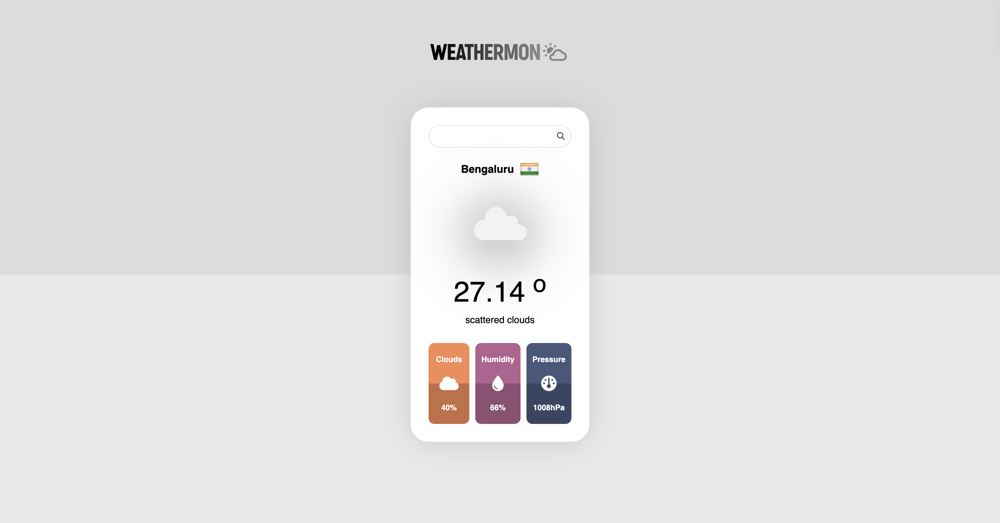

# Weathermon

A simple and elegant weather application that allows users to search for weather information of different cities.

## Screenshot



## Features

- Search for weather information by city name
- Display current temperature, weather description, and city name
- Show country flag of the searched city
- Provide additional details like cloudiness, humidity, and pressure
- Responsive design for various screen sizes
- Error handling for invalid city names

## Technologies Used

- HTML5
- CSS3
- JavaScript (ES6+)
- OpenWeatherMap API
- Flags API
- Font Awesome icons

## Getting Started

### Prerequisites

- Basic knowledge of HTML, CSS, and JavaScript
- API key from [OpenWeatherMap](https://openweathermap.org/api)

### Installation

1. Clone the repository:
```sh
git clone https://github.com/quicksilver812/weathermon.git
```

2. Navigate to the project directory:
```sh
cd weather-app
```

3. Replace the id variable in the JavaScript code with your OpenWeatherMap API key.
```sh
let id = 'YOUR_API_KEY_HERE';
```

### Usage
1. Open `index.html` in your browser.
2. Enter the name of the city you want to search for in the input field and press the search button

License
This project is licensed under the MIT License - see the [LICENSE](LICENSE) file for details.
